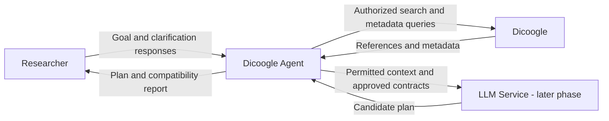

[[Home]] · [[Architecture v0.1]] · [[Components]] · [[Sequence]]

# System Context

Proposed external relationships, not verified integrations.

```mermaid
flowchart LR
    U["Researcher"] -->|"Goal and clarification responses"| A["Dicoogle Agent"]
    A -->|"Plan and compatibility report"| U
    A -->|"Authorized search and metadata queries"| D["Dicoogle"]
    D -->|"References and metadata"| A
    A -->|"Permitted context and approved contracts"| L["LLM Service - later phase"]
    L -->|"Candidate plan"| A
```
